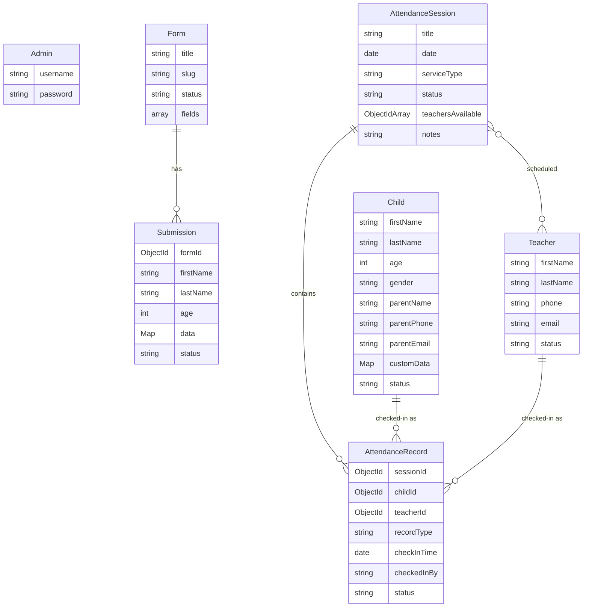

# TCN Lekki Form Builder & Attendance Desk

A modern, comprehensive Next.js 16 web application designed for the **TCN Lekki** church community. This portal streamlines event registrations, manages active directories for children and teachers, provides a self-service check-in kiosk, and delivers robust attendance tracking with automated absentee follow-up workflows.

---

## 🌟 Key Features

### 1. Dynamic Form Builder & Event Registration
* **Custom Event Forms:** Generate customizable registration pages with custom slugs (e.g., `/[formSlug]`).
* **Flexible Fields:** Support for standard and custom input types, including text, numbers, emails, select dropdowns, textareas, dates, and booleans.
* **Intelligent Real-time Duplicate Engine:** As users type, the form validates inputs in real-time to alert parents if a record already exists:
  * **Level 1 (First Name Match):** Shows a gentle warning checking if the user has registered before.
  * **Level 2 (First + Last Name Match):** Displays a prominent warning indicating a matching record.
  * **Level 3 (Exact Name + Age Match):** Triggers a browser confirmation block and flags the submission as `Needs Review`.
* **Submission Moderation:** Admin dashboard panel to filter, review, approve, or delete submissions.
* **CSV Exporting:** Seamlessly download all form submissions for external analysis.

### 2. Centralized Roster Directories
* **Children Directory:** Centralized portal containing names, ages, gender, parent names, contact phones, and emails. Contains direct links to each child's historical attendance log.
* **Teachers Directory:** List of all registered teachers, phone numbers, emails, and historic service duty log.

### 3. Attendance & Session Manager
* **Session Logging:** Create check-in sessions customized by Date, Title, and Service Type (`1st Service`, `2nd Service`, `Special Event`).
* **Curriculum Tracking:** Store lesson notes, memory verses, or taught topics inside each session.
* **Teacher Scheduling:** Link active teachers to specific services.
* **Roster Check-in Board:** Interactive desktop roster to toggle check-in status (Optimistic UI updates with MongoDB sync).
* **Automated Follow-up Tracker:** Scans database history to identify children who have been **absent for 2 or more consecutive weeks**, providing quick call shortcuts (`tel:`) for parents.
* **Roster Reporting:** Export session attendance lists directly to CSV format.

### 4. Self-Service Check-in Kiosk
* **Desk Check-in Board:** A public-facing check-in dashboard designed for tablet desks at the entrance (`/admin/attendance/kiosk`).
* **Fuzzy Search:** Quick search of the active roster by name or parent phone number.
* **Instant Overlays:** Confirm check-in with micro-animations and name-initial avatars.
* **Offline Kiosk Safety:** Displays a descriptive offline landing page if no active attendance session has been launched by admins.

---

## 🛠 Tech Stack

* **Framework:** Next.js 16.2 (App Router)
* **Frontend Library:** React 19, Lucide React
* **Styling:** Tailwind CSS v4
* **Database:** MongoDB (via Mongoose ODM)
* **Authentication:** JWT Sessions (`jose` & `bcryptjs`) secured via Next.js Middleware cookies (`admin_session`)

---

## 📂 Database Architecture & Schemas

The application uses seven interconnected MongoDB collections defined inside the `src/models/` folder:



### Collection Details & Indexing

#### 1. `Child`
* **Fields:** `firstName`, `lastName`, `age`, `gender` (Male/Female), `parentName`, `parentPhone`, `parentEmail`, `customData` (Map), `status` (active/inactive).
* **Indexes:** Compound index `{ firstName: 1, lastName: 1 }` and search index `{ parentPhone: 1 }`.

#### 2. `Teacher`
* **Fields:** `firstName`, `lastName`, `phone`, `email`, `status` (active/inactive).
* **Indexes:** Compound index `{ firstName: 1, lastName: 1 }`.

#### 3. `Form`
* **Fields:** `title`, `slug` (unique), `status` (active/disabled), `fields` (Array of FormField: `name`, `label`, `type`, `required`, `options`).

#### 4. `Submission`
* **Fields:** `formId` (Ref `Form`), `firstName`, `lastName`, `age`, `data` (Map of custom inputs), `status` (approved/needs_review/rejected).
* **Indexes:** Compound index `{ formId: 1, firstName: 1, lastName: 1 }` to optimize duplicate check speeds.

#### 5. `AttendanceSession`
* **Fields:** `title`, `date`, `serviceType` (1st Service/2nd Service/Special Event), `status` (active/closed), `teachersAvailable` (Refs `Teacher`), `notes`.
* **Indexes:** Compound index `{ date: 1, serviceType: 1 }`.

#### 6. `AttendanceRecord`
* **Fields:** `sessionId` (Ref `AttendanceSession`), `childId` (Ref `Child`), `teacherId` (Ref `Teacher`), `recordType` (child/teacher), `checkInTime`, `checkedInBy` (self/admin), `status` (present/absent).
* **Indexes:** Compound unique indexes to prevent double check-ins:
  * `{ sessionId: 1, childId: 1 }` (unique, sparse)
  * `{ sessionId: 1, teacherId: 1 }` (unique, sparse)

---

## 🌐 API Route Directory

### Authentication
* `POST /api/auth/setup` - Registers the initial admin account.
* `POST /api/auth/login` - Signs in admins and issues cookie.
* `POST /api/auth/logout` - Clear admin session cookies.

### Public Client Endpoints
* `GET /api/forms/[slug]` - Fetches a form's custom fields and configuration.
* `POST /api/submissions` - Submits a guest/child event registration.
* `POST /api/check-duplicate` - Performs real-time validation checks for names/ages on forms.

### Protected Admin Endpoints (`/api/admin/*`)
* `GET /api/admin/stats` - Overall dashboard stats counter.
* `GET /api/admin/forms` - Retrieves list of all forms.
* `POST /api/admin/forms` - Creates a new dynamic form.
* `DELETE /api/admin/forms/[id]` - Deletes a form configuration.
* `GET /api/admin/forms/[id]/submissions` - Retrieve form submissions.
* `GET /api/admin/forms/[id]/export` - Exports submissions as CSV file.
* `PATCH /api/admin/submissions/[id]` - Updates status (e.g. Approve a needs_review submission).
* `DELETE /api/admin/submissions/[id]` - Deletes a specific submission.
* `GET /api/admin/children` - Retrieves children directory list.
* `POST /api/admin/children` - Registers a child manually.

### Protected Attendance Endpoints (`/api/admin/attendance/*`)
* `GET /api/admin/attendance/stats` - Stats on children/teachers counts, attendance rate, and absentee follow-up list.
* `GET /api/admin/attendance/sessions` - Retrieves list of sessions. Pass `active=true` to get the current desk check-in session.
* `POST /api/admin/attendance/sessions` - Creates and launches a new service attendance session.
* `PATCH /api/admin/attendance/sessions` - Toggles status (Open/Close session).
* `GET /api/admin/attendance/roster` - Retrieves roster check-in mapping for a session.
* `POST /api/admin/attendance/checkin` - Toggles check-in state (present/absent) for children/teachers.
* `GET /api/admin/attendance/export` - Export session roster as a CSV attendance report.
* `GET /api/admin/attendance/teachers` - Retrieves registered teachers list.
* `POST /api/admin/attendance/teachers` - Registers a new teacher.

---

## 🚀 Quick Start Guide

### 1. Prerequisites
Ensure you have the following installed:
* **Node.js** (v18 or higher)
* **MongoDB** (Atlas connection URI or local instance)

### 2. Environment Configurations
Create a `.env.local` file at the root of the project with the following properties:
```env
MONGODB_URI=mongodb+srv://<username>:<password>@cluster.mongodb.net/tcn_db
JWT_SECRET=your_super_secure_jwt_secret_key_here
```

### 3. Setup & Running Development
```bash
# Clone the repository and navigate into the directory
cd form-builder

# Install dependencies
npm install

# Run the development server
npm run dev
```

The portal will be running locally at **`http://localhost:3000`**.

### 4. Bootstrapping Admin Account
To create your first admin account:
1. Navigate to `http://localhost:3000/setup` in your browser.
2. Fill out the **Initial Setup** form with your desired admin username and password.
3. Click **Create Admin Account**. You will be redirected to the Admin Login screen.
4. Log in at `/admin/login` to access the Admin Dashboard.
