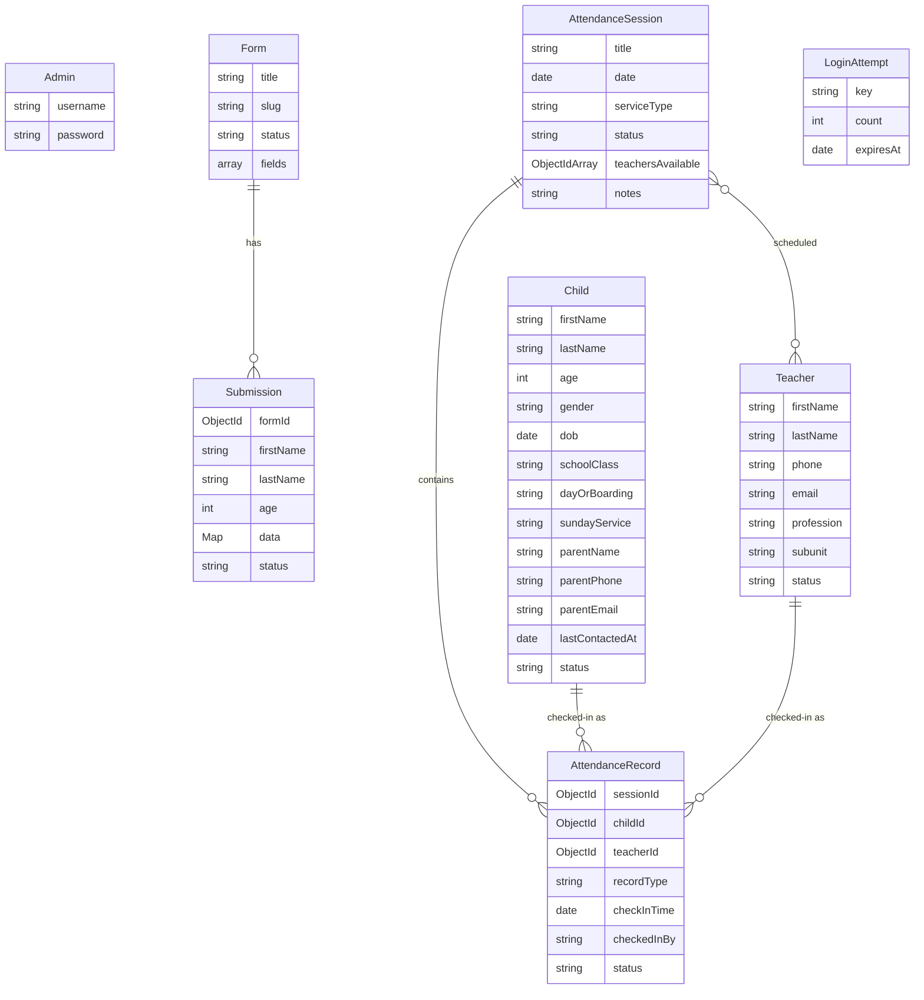

# TCN Lekki Form Builder & Attendance Desk

A modern, comprehensive Next.js 16 web application designed for the **TCN Lekki** church community. This portal streamlines event registrations, manages active directories for children and mentors, provides a self-service check-in kiosk, and delivers Sunday-based attendance reporting with automated absentee follow-up workflows.

---

## 🌟 Key Features

### 1. Dynamic Form Builder & Event Registration
* **Custom Event Forms:** Generate customizable registration pages with custom slugs (e.g., `/[formSlug]`).
* **Flexible Fields:** Support for standard and custom input types, including text, numbers, emails, select dropdowns, textareas, dates, and booleans.
* **Intelligent Real-time Duplicate Engine:** As users type, the form validates inputs in real-time to alert parents if a record already exists:
  * **Level 1 (First Name Match):** Shows a gentle warning checking if the user has registered before.
  * **Level 2 (First + Last Name Match):** Displays a prominent warning indicating a matching record.
  * **Level 3 (Exact Name + Age Match):** Triggers a browser confirmation block and flags the submission as `Needs Review`.
* **Submission Moderation:** Admin dashboard panel to filter, review, approve, or delete submissions.
* **CSV Exporting:** Seamlessly download all form submissions for external analysis.

### 2. Centralized Roster Directories
* **Children Directory:** Centralized portal containing names, ages, gender, date of birth, class, day/boarding status, preferred Sunday service, parent names, contact phones, and emails. Contains direct links to each child's historical attendance log. Registration requires the full core details and blocks duplicates (same name, parent phone, and date of birth).
* **Mentors Directory:** List of all registered mentors with phone numbers, emails, professional details, sub-unit, and a historic service duty log. Mentors can self-register through a public link (`/register/mentor`) or be added by an admin; duplicates (same name and phone) are blocked.

### 3. Attendance & Session Manager
* **Session Logging:** Create check-in sessions customized by Date, Title, and Service Type (`1st Service`, `2nd Service`, `Special Event`). Only one session per service type is allowed per date.
* **Curriculum Tracking:** Store lesson notes, memory verses, or taught topics inside each session.
* **Mentor Scheduling:** Link active mentors to specific services.
* **Roster Check-in Board:** Interactive roster to toggle check-in status (optimistic UI updates with MongoDB sync). The board lists every active child and mentor, so anyone who switches services can always find their name.
* **Live Present Counts:** Each roster shows a live "present / total" tally for children and mentors.
* **Roster Reporting:** Export session attendance lists directly to CSV format.

### 4. Sunday Reports
* **Sunday-level Rollups:** The two Sunday services are grouped by date into a single day-level view, so you see the true picture per Sunday rather than per isolated session.
* **Per-service Breakdown:** Each service shows present children with a boys/girls split, plus the mentor count.
* **Distinct Sunday Total:** Anyone present at both services is counted **once** in the day's distinct totals.
* **Date Filter:** Open any Sunday on record, not just the most recent.
* **Absentee Follow-up:** Flags children who missed **3 or more consecutive Sundays** (regular services only; special events are ignored; counting starts once a child is registered and never flags an in-progress Sunday). Provides quick call shortcuts (`tel:`) and a "Mark contacted" action that hides a child until they miss another Sunday.

### 5. Self-Service Check-in Kiosk
* **Public Check-in Boards:** Tablet-friendly, session-scoped check-in pages for children (`/attendance/child/[sessionId]`) and mentors (`/attendance/teacher/[sessionId]`).
* **Privacy-safe Roster:** Unauthenticated kiosk pages receive only the fields needed to check people in (name, age, gender, status) — never parent contact details.
* **Name Search:** Quick search of the active roster by name.
* **Instant Overlays:** Confirm check-in with micro-animations and name-initial avatars.
* **Offline Kiosk Safety:** Displays a descriptive landing page if no active attendance session has been launched by admins.

---

## 🔒 Security & Data Protection

* **Authenticated Admin Surface:** Every `/admin` page and every `/api/admin/*` endpoint requires a valid admin session, enforced in middleware. The only public exemptions are the session-scoped kiosk calls (check-in, and roster/session reads that carry a `sessionId`).
* **Mandatory Signing Secret:** Sessions are signed with `JWT_SECRET`. The app fails closed if it is not configured — there is no insecure fallback.
* **Gated Admin Bootstrap:** The initial admin can be created on a fresh install; once any admin exists, `/setup` (page and API) requires a logged-in admin.
* **Brute-force Protection:** Login is rate-limited per client, backed by a self-expiring collection.
* **Duplicate Protection:** Database-enforced uniqueness on children plus application-level checks on children and mentors.
* **Minimal Data Exposure:** Public responses are scoped to non-sensitive fields, and API errors are generic (full detail is written to server logs only).

---

## 🛠 Tech Stack

* **Framework:** Next.js 16.2 (App Router)
* **Frontend Library:** React 19, Lucide React
* **Styling:** Tailwind CSS v4
* **Database:** MongoDB (via Mongoose ODM)
* **Authentication:** JWT Sessions (`jose` & `bcryptjs`) secured via Next.js Middleware cookies (`admin_session`)

---

## 📂 Database Architecture & Schemas

The application uses eight MongoDB collections defined inside the `src/models/` folder:



### Collection Details & Indexing

#### 1. `Child`
* **Fields:** `firstName`, `lastName`, `age`, `gender` (Male/Female), `dob`, `schoolClass`, `dayOrBoarding` (Day/Boarding), `sundayService` (1st Service/2nd Service/Either), `parentName`, `parentPhone`, `parentEmail`, `phone`, `email`, `customData` (Map), `lastContactedAt`, `status` (active/inactive). Core identity and guardian fields are required.
* **Indexes:** Search indexes `{ firstName: 1, lastName: 1 }` and `{ parentPhone: 1 }`, plus a unique identity index `{ firstName, lastName, parentPhone, dob }` (case-insensitive) to prevent duplicate children.

#### 2. `Teacher` (Mentors)
* **Fields:** `firstName`, `lastName`, `phone`, `email`, `dob`, `weddingAnniversary`, `address`, `profession`, `company`, `subunit`, `status` (active/inactive).
* **Indexes:** Compound index `{ firstName: 1, lastName: 1 }`.

#### 3. `Form`
* **Fields:** `title`, `slug` (unique), `status` (active/disabled), `fields` (Array of FormField: `name`, `label`, `type`, `required`, `options`).

#### 4. `Submission`
* **Fields:** `formId` (Ref `Form`), `firstName`, `lastName`, `age`, `data` (Map of custom inputs), `status` (approved/needs_review/rejected).
* **Indexes:** Compound index `{ formId: 1, firstName: 1, lastName: 1 }` to optimize duplicate check speeds.

#### 5. `AttendanceSession`
* **Fields:** `title`, `slug`, `date`, `serviceType` (1st Service/2nd Service/Special Event), `status` (active/closed), `teachersAvailable` (Refs `Teacher`), `notes`.
* **Indexes:** Compound index `{ date: 1, serviceType: 1 }`.

#### 6. `AttendanceRecord`
* **Fields:** `sessionId` (Ref `AttendanceSession`), `childId` (Ref `Child`), `teacherId` (Ref `Teacher`), `recordType` (child/teacher), `checkInTime`, `checkedInBy` (self/admin), `status` (present/absent).
* **Indexes:** Compound unique partial indexes to prevent double check-ins:
  * `{ sessionId: 1, childId: 1 }` (unique, partial)
  * `{ sessionId: 1, teacherId: 1 }` (unique, partial)

#### 7. `Admin`
* **Fields:** `username` (unique), `password` (bcrypt hash). Capped at two accounts.

#### 8. `LoginAttempt`
* **Fields:** `key` (client identifier), `count`, `expiresAt`.
* **Indexes:** TTL index on `expiresAt` (`expireAfterSeconds: 0`) so records self-expire.

---

## 🌐 API Route Directory

### Authentication
* `POST /api/auth/setup` - Creates an admin account (open on first run; requires a logged-in admin thereafter).
* `POST /api/auth/login` - Signs in admins and issues cookie (rate-limited).
* `POST /api/auth/logout` - Clears admin session cookie.

### Public Client Endpoints
* `GET /api/forms/[slug]` - Fetches a form's custom fields and configuration.
* `POST /api/submissions` - Submits a guest/child event registration.
* `POST /api/check-duplicate` - Performs real-time validation checks for names/ages on forms.
* `POST /api/mentors/register` - Public mentor self-registration.

### Protected Admin Endpoints (`/api/admin/*`)
* `GET /api/admin/stats` - Overall dashboard stats counter.
* `GET /api/admin/forms` - Retrieves list of all forms.
* `POST /api/admin/forms` - Creates a new dynamic form.
* `DELETE /api/admin/forms/[id]` - Deletes a form configuration.
* `GET /api/admin/forms/[id]/submissions` - Retrieve form submissions.
* `GET /api/admin/forms/[id]/export` - Exports submissions as CSV file.
* `PATCH /api/admin/submissions/[id]` - Updates status (e.g. Approve a needs_review submission).
* `DELETE /api/admin/submissions/[id]` - Deletes a specific submission.
* `GET /api/admin/children` - Retrieves children directory list.
* `POST /api/admin/children` - Registers a child manually (with duplicate protection).
* `GET /api/admin/children/export` - Exports the children directory as CSV.

### Protected Attendance Endpoints (`/api/admin/attendance/*`)
* `GET /api/admin/attendance/stats` - Stats on children/mentors counts, attendance rate, and absentee follow-up list.
* `GET /api/admin/attendance/reports` - Sunday-grouped attendance reports (per-service and distinct rollups, follow-up list). Supports `?date=YYYY-MM-DD` and `?limit=N`.
* `POST /api/admin/attendance/followup` - Marks an absent child as contacted, or undoes it.
* `GET /api/admin/attendance/sessions` - Retrieves list of sessions. Pass `active=true` to get the current desk check-in session.
* `POST /api/admin/attendance/sessions` - Creates and launches a new service attendance session (one per service type per date).
* `PATCH /api/admin/attendance/sessions` - Toggles status (Open/Close session).
* `GET /api/admin/attendance/roster` - Retrieves roster check-in mapping for a session (fields scoped by authentication).
* `POST /api/admin/attendance/checkin` - Toggles check-in state (present/absent) for children/mentors.
* `GET /api/admin/attendance/export` - Export session roster as a CSV attendance report.
* `GET /api/admin/attendance/teachers` - Retrieves registered mentors list.
* `POST /api/admin/attendance/teachers` - Registers a new mentor (with duplicate protection).
* `GET /api/admin/attendance/teachers/export` - Exports the mentors directory as CSV.

---

## 🚀 Quick Start Guide

### 1. Prerequisites
Ensure you have the following installed:
* **Node.js** (v20 or higher recommended)
* **MongoDB** (Atlas connection URI or local instance)

### 2. Environment Configurations
Create a `.env` file at the root of the project with the following properties:
```env
MONGODB_URI=mongodb+srv://<username>:<password>@cluster.mongodb.net/tcn_db
JWT_SECRET=your_super_secure_jwt_secret_key_here
```
`JWT_SECRET` is **required** — the app will refuse to start without it. Generate a strong value with `openssl rand -base64 48`. Optional SMTP variables (`SMTP_USER`, `SMTP_PASS`) enable registration confirmation emails.

### 3. Setup & Running Development
```bash
# Clone the repository and navigate into the directory
cd form-builder

# Install dependencies
npm install

# Run the development server
npm run dev
```

The portal will be running locally at **`http://localhost:3000`**.

### 4. Bootstrapping Admin Account
To create your first admin account:
1. Navigate to `http://localhost:3000/setup` in your browser.
2. Fill out the **Initial Setup** form with your desired admin username and password.
3. Click **Create Admin Account**. You will be redirected to the Admin Login screen.
4. Log in at `/admin/login` to access the Admin Dashboard.

> Note: `/setup` is only open while no admin exists. Once an admin is created, an existing admin must be logged in to add another (accounts are capped at two).
